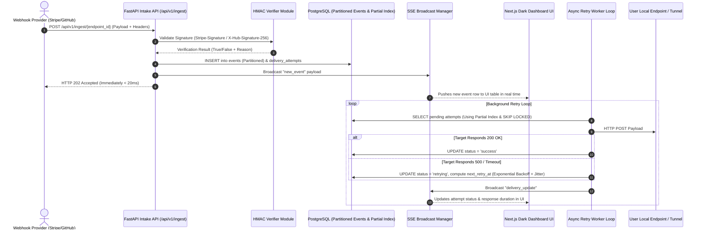

# Developer Webhook Relay & Replay Platform: Codebase & Tech Stack Guide

Welcome to the full codebase walkthrough for the **Developer Webhook Relay & Replay Platform**! This guide is written specifically to help you understand every layer of the technology stack, why specific architectural choices were made, and how all components interact.

---

## 🧭 1. Tech Stack Overview & Why Each Tool Was Chosen

| Component | Technology | Why We Use It |
| :--- | :--- | :--- |
| **Backend Framework** | **FastAPI (Python 3.12)** | Asynchronous (`async/await`) request intake capable of handling high concurrency with $< 20\text{ ms}$ latency. Automatic OpenAPI / Swagger documentation and typing via Pydantic. |
| **Database** | **PostgreSQL 16** | Relational integrity with advanced features: **Range Partitioning** for high-volume logs and **Partial Indexes** for instant worker job polling. |
| **Database ORM** | **Async SQLAlchemy 2.0 + asyncpg** | Non-blocking database I/O. `asyncpg` is the fastest PostgreSQL driver for Python. |
| **Cryptographic Engine** | **Python `hmac` & `hashlib`** | Built-in security modules to compute and verify HMAC-SHA256 digests for Stripe, GitHub, Shopify, and custom vendors. |
| **Real-time Streaming** | **Server-Sent Events (SSE) (`sse-starlette`)** | Lightweight, single-direction HTTP streaming from server to browser. Unlike WebSockets, SSE automatically handles reconnection and works over standard HTTP/1.1 or HTTP/2 without stateful socket overhead. |
| **Frontend Dashboard** | **Next.js 14 (App Router) + React 18** | Modern UI framework with React Server Components, TypeScript support, and Client Components for dynamic live log streams. |
| **Styling & UI** | **Tailwind CSS + Lucide Icons** | Utility-first CSS for a clean, responsive dark-mode developer experience. |
| **Local CLI Client** | **Python Typer + HTTPX** | CLI utility that long-polls the SSE feed and forwards webhooks to local dev servers (`http://localhost:3000`). |

---

## 🏗️ 2. High-Level Architecture & Request Lifecycle



---

## 🔍 3. Deep-Dive Code Walkthrough

### A. Low-Latency Ingestion Engine (`backend/app/api/ingest.py`)
When a webhook arrives from Stripe or GitHub:
1. The route accepts the request asynchronously without blocking threads.
2. It fetches the raw bytes using `await request.body()` (necessary because calculating HMAC signatures requires exact raw body bytes without JSON re-formatting).
3. It passes headers and raw body to the provider's verifier.
4. It saves the event to PostgreSQL and creates a `DeliveryAttempt` record staged for execution.
5. It calls `await sse_manager.broadcast("new_event", ...)` so any connected Next.js dashboard updates instantly.
6. It returns HTTP `202 Accepted` immediately.

### B. Cryptographic Signature Verifiers (`backend/app/verifiers/`)
- **Stripe (`stripe.py`)**: Stripe sends headers like `Stripe-Signature: t=1614000000,v1=9f8a...`.
  The verifier extracts timestamp `t` and signature `v1`, constructs payload `${t}.${raw_body}`, computes `hmac.new(secret, payload, sha256)`, and uses `hmac.compare_digest` to prevent timing attacks.
- **GitHub (`github.py`)**: Expects `X-Hub-Signature-256: sha256=...`. Computes HMAC-SHA256 over raw body.
- **Shopify (`shopify.py`)**: Expects `X-Shopify-Hmac-SHA256` containing a base64-encoded digest.

### C. PostgreSQL Database Optimizations (`backend/init_db.sql`)

#### 1. Range Partitioning on `events` Table:
```sql
CREATE TABLE events (...) PARTITION BY RANGE (created_at);
```
- **Why?** High-volume webhook platforms accumulate millions of event logs. Partitioning breaks the single massive table into smaller monthly tables (`events_2026_10`, `events_2026_11`). This keeps indexes small, queries fast, and allows dropping old data by dropping a partition instantly instead of slow `DELETE` statements.

#### 2. Partial Indexing on `delivery_attempts`:
```sql
CREATE INDEX idx_delivery_pending_retries 
ON delivery_attempts (next_retry_at, status) 
WHERE status IN ('pending', 'retrying');
```
- **Why?** In a system with 1,000,000 completed deliveries and only 10 pending retries, a standard index indexes all 1,000,000 rows. A **Partial Index** indexes *only* the 10 pending/retrying rows! The worker query evaluates in $< 1\text{ ms}$.

#### 3. Concurrency Control with `FOR UPDATE SKIP LOCKED`:
```sql
SELECT id FROM delivery_attempts
WHERE status IN ('pending', 'retrying') AND next_retry_at <= NOW()
LIMIT 50
FOR UPDATE SKIP LOCKED
```
- **Why?** If you run multiple worker processes in parallel, `SKIP LOCKED` prevents worker #2 from selecting rows that worker #1 is already processing. No duplicate deliveries, no lock contention.

### D. Exponential Backoff & Jitter Algorithm (`backend/app/services/retry_worker.py`)
When a target endpoint fails (returns HTTP `500` or times out), we calculate the next retry delay:

$$\text{wait\_seconds} = \min(\text{MAX\_BACKOFF}, \text{INITIAL\_BACKOFF} \times 2^{(\text{attempt} - 1)} + \text{uniform\_jitter}(0, 5))$$

```python
def calculate_next_retry(attempt_count: int) -> datetime:
    base_backoff = settings.INITIAL_BACKOFF_SECONDS * (2 ** (attempt_count - 1))
    jitter = random.uniform(0, settings.JITTER_MAX_SECONDS)
    total_seconds = min(settings.MAX_BACKOFF_SECONDS, base_backoff + jitter)
    return datetime.now(timezone.utc) + timedelta(seconds=total_seconds)
```
- **Attempt 1**: $\sim 5\text{ seconds}$
- **Attempt 2**: $\sim 10-15\text{ seconds}$
- **Attempt 3**: $\sim 20-25\text{ seconds}$
- **Attempt 4**: $\sim 40-45\text{ seconds}$
- **Attempt 5**: $\sim 80-85\text{ seconds}$

*Jitter adds randomness so 1,000 retrying webhooks don't hit a recovering server at the exact same millisecond.*

### E. Next.js Dark-Mode Live Inspection UI (`frontend/app/`)
- **App Router (`app/page.tsx`)**: Initializes `EventSource("/api/v1/events/stream/live")`.
- When `new_event` arrives, React prepends the new row to the table.
- Clicking an event opens `EventDetailDrawer.tsx`, showing formatted JSON payloads, headers, raw body, and HTTP attempt response times.
- **Replay Modal (`ReplayModal.tsx`)**: Lets developers edit the payload JSON or target URL and POST to `/api/v1/events/{id}/replay` to immediately re-fire past requests.

---

## 🛠️ 4. How to Run & Test Everything Locally

### 1. Start PostgreSQL & Redis via Docker
```bash
cd webhook-relay
docker compose up -d
```

### 2. Run Backend API
```bash
cd backend
source venv/bin/bin/activate # or venv/bin/activate
PYTHONPATH=. uvicorn app.main:app --reload --port 8000
```
Open API Docs: `http://localhost:8000/docs`

### 3. Run Next.js Frontend
```bash
cd frontend
npm run dev
```
Open Dashboard UI: `http://localhost:3000`

### 4. Run Pytest Test Suite
```bash
cd backend
PYTHONPATH=. venv/bin/pytest tests/
```

### 5. Run Local CLI Tunnel Client
```bash
cd cli
python3 relay_cli.py --target http://localhost:3000/api/webhook --endpoint <YOUR_ENDPOINT_ID>
```
